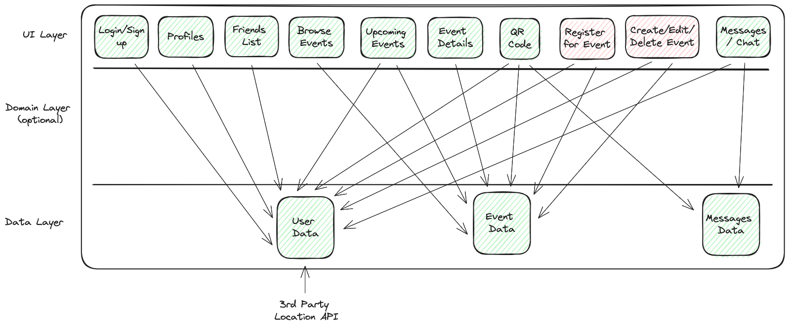

# Functional Requirements

*Max 3 pages.*

*List the key features of the MVP precisely.*
- Browse and discover nearby events.
- Registering to join events.
- Create and manage events including location and attendee details.
- QR code scanning for both friendship connections and event entry verification.
- Secure messaging system to communicate with contacts made at events.

*Include appropriate architectural diagrams.*

[Image Link](https://excalidraw.com/#json=n2223D8IlggcIHplABkOC,MMKRiq6O-Cz21lEovHRE3w)
_revised 1/5/2024_

*Describe key internal functionality.*
- Real-time event updates to users based on location and preferences.
- Backend logic for QR code generation and scanning.
- Integration of the messaging system with user profiles and event details.
